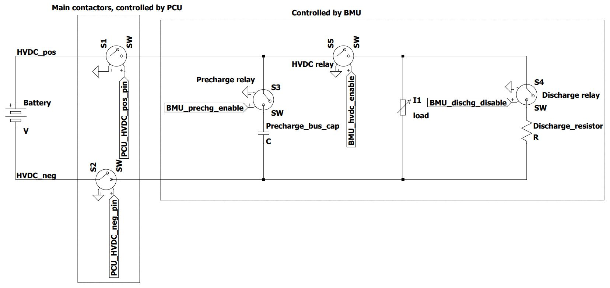

# Pack Control Unit (PCU)
This repo contains the code for the PCU on Helia. It is very different to the version in the [CUER Embedded PCU repo](https://github.com/CUER/Embedded/tree/master/PCU) as changes had been made in the run up to the 2019 Word Solar Challenge. The version in this repo is broadly similar to the one used in the 2019 World Solar Challenge, with updated code compatible with mbedOS 6 and changes made to adapt to the current state of Helia. There are 2 PCUs in Helia, one in the front battery pack and the other in the rear. The code works for both of these PCU as their CAN ID is configured with the physical DIP switches on the board. The software will take the DIP config into account and set the appropriate CAN IDs. The PCU (located in the battery pack) works in conjunction with the Battery Management Unit (BCU, located in the HV box) to control the relays in the HV system of the car.

## Functionality
Below is a high level diagram of Helia's HV system. The solar relay has not been included in this diagram. 

| Functionality | Description |
| --- | --- |
| Main contactors control | The main contactors are responsible for connecting/disconnecting the pos and neg wires of each battery pack to its output port. The state of the main contactors are controlled based on the CAN message from the BMU. It compares the desired state to the current state of the HVDC contactor and make a decision. |
| Check timeouts from BMU | Check if it's been too long since BMU has communicated through CAN. The main contactors will open if the BMU status message hasn't been received for 5s. |
| Cell voltage measurements and broadcast | Interface with the LTC68XX chip to read cell voltages and send them onto the CAN bus for BMU to interpret. |

## Application functionality
The PCU is quite passive as it listens to CAN message from BMU and open/close the main contactors. It also checks the voltage of each cells and sends out a CAN message with the voltage measurements at a set interval.

## Building and running
Clone this project and load it in Mbed Studio. You can build and run the program on it.

Once, it has been built, the binary is located at `./BUILD/LPC1768/ARMC6/cuer_pcu.bin` 

You can directly upload the program onto the LPC1768 on Mbed Studio.
Alternatively, you can manually copy the binary to the board, which you mount on the host computer over USB.

